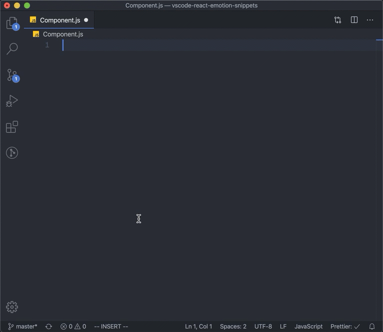

# VS Code React Emotion Snippets


[](https://marketplace.visualstudio.com/items?itemName=mskelton.react-emotion-snippets)
[](https://marketplace.visualstudio.com/items?itemName=mskelton.react-emotion-snippets)
[](#contributors-)
[](https://github.com/semantic-release/semantic-release)

> [React Emotion](https://emotion.sh) snippets for VS Code.



## Snippets

The following snippets are provided by this package. If you have ideas of other snippets that would be helpful, please [open an issue](https://github.com/mskelton/vscode-react-emotion-snippets/issues/new).

### Imports

| Prefix | Method                                     | Prefix meaning          |
| ------ | ------------------------------------------ | ----------------------- |
| `ies→` | `import styled from '@emotion/core'`       | _Import Emotion styled_ |
| `iec→` | `import { css, jsx } from '@emotion/core'` | _Import Emotion css_    |
| `iej→` | `import { jsx } from '@emotion/core'`      | _Import Emotion jsx_    |

### Other snippets

#### `ces→`

_Create Emotion style_

<!-- prettier-ignore-start -->
```js
const style = css`

`
```

#### `cec→`

_Create Emotion component_

```js
/** @jsx jsx **/
import { jsx } from '@emotion/core'

function Component(props) {

}
```
<!-- prettier-ignore-end -->

## Contributors ✨

Thanks goes to these wonderful people ([emoji key](https://allcontributors.org/docs/en/emoji-key)):

<!-- ALL-CONTRIBUTORS-LIST:START - Do not remove or modify this section -->
<!-- prettier-ignore-start -->
<!-- markdownlint-disable -->
<table>
  <tr>
    <td align="center"><a href="https://github.com/mskelton"><br /><sub><b>Mark Skelton</b></sub></a><br /><a href="https://github.com/mskelton/vscode-react-emotion-snippets/commits?author=mskelton" title="Code">💻</a> <a href="#ideas-mskelton" title="Ideas, Planning, & Feedback">🤔</a> <a href="https://github.com/mskelton/vscode-react-emotion-snippets/commits?author=mskelton" title="Documentation">📖</a></td>
    <td align="center"><a href="https://github.com/doong-jo"><br /><sub><b>Sungdong Jo</b></sub></a><br /><a href="https://github.com/mskelton/vscode-react-emotion-snippets/commits?author=doong-jo" title="Documentation">📖</a> <a href="https://github.com/mskelton/vscode-react-emotion-snippets/commits?author=doong-jo" title="Code">💻</a></td>
  </tr>
</table>

<!-- markdownlint-enable -->
<!-- prettier-ignore-end -->

<!-- ALL-CONTRIBUTORS-LIST:END -->

This project follows the [all-contributors](https://github.com/all-contributors/all-contributors) specification. Contributions of any kind welcome!
